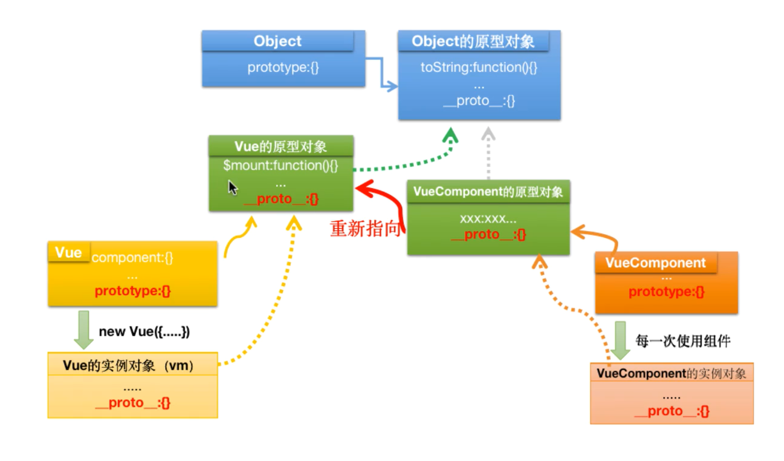
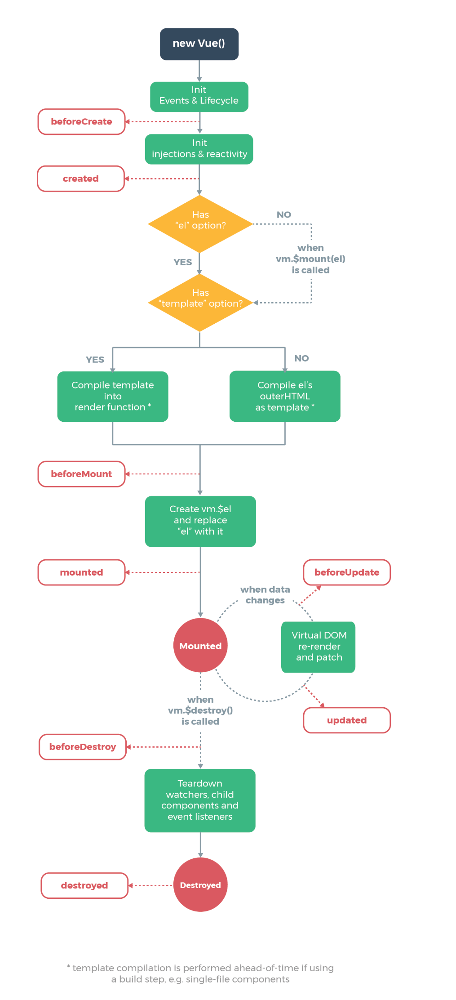
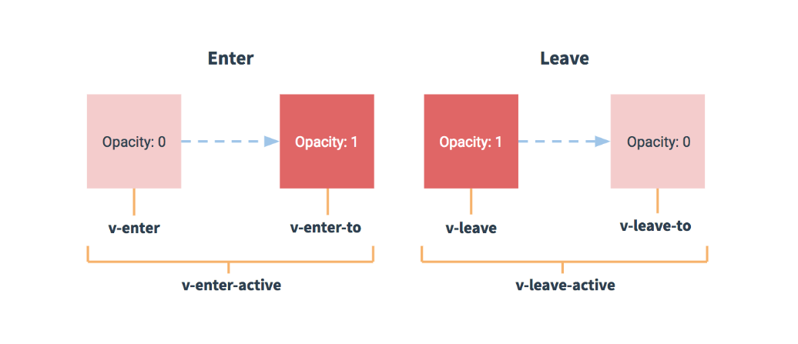

# Vue2.0

## 前端框架简介

- 框架与库的区别?
  - 库 : 一个小型的功能中心, 专注于实现某些特有功能
  - 框架 : 一个大型的解决方案, 专注于业务逻辑操作

## 前端三大架构 —— MV\*系列架构

在这里, MV\* 指的是以 MV 开头的几种架构模式

**MVC 模式.**

- `M表示Model`, 即模型层, 负责保存应用数据, 并且与后端同步
- `V表示View`, 即视图层, 负责视图展示, 将模型层的数据展示出来
- `C表示Controller`, 即控制器, 负责业务逻辑, 根据用户行为修改模型层的数据

> - 数据流混乱, 可维护性差
>   - 控制器修改模型层, 模型层改变, 会导致视图层发生变化
>   - 视图层发生变化, 模型层也会有相应变化
>   - 无法区分是由于控制器修改的模型层还是视图层修改的模型层

**MVP 模式(前端不存在).**

- `P表示Presenter`, 即中间层, 负责模型层与视图层之间的联系

> - 视图层的修改不会再导致模型层的修改
> - 视图层与模型层之间的数据传输都需要经过中间层
>   - 导致中间层的数据过多, 体积庞大
>   - 因为没有在中间层绑定数据, 所有的同步与更新都要中间层进行手动操作

**MVVM 模式.**

- `VM表示视图模型层`, 绑定了模型层与视图层的数据
  - 当模型层数据改变后, 视图层会自动进行相应改变
  - 视图层数据发生改变, 模型层也会相应发生改变

> - 双向数据绑定 => 数据响应机制, 更新策略, diff 算法
> - 数据驱动视图

## Vue2.0 的起步

- 引入 `Vue` 的 `.js` 文件
- 创建挂载 `Vue` 的根 DOM
- 创建一个 `Vue` 实例并挂载到根 Dom
- `Vue` 实例中的参数为键值对的形式传递

```JavaScript
// 创建并挂载 Vue 实例到 Dom 对象中
let app=new Vue({
  el:'dom',
  data:{
    key:value
  }
})

// 或者使用第二种方法来创建并挂载 Vue 实例
let app=new Vue({
  data:{
    key:value
  }
}).$mount('dom')

// 使用实例对象直接访问 Vue 中的变量
app.key
```

- 如果要在 html 页面中使用定义的 Vue 变量, 需要使用 `{{ }}` 来访问
- 使用 Vue 建立第一个网页时, 控制台会报出两条错误
  - 安装 `devTool` 用来调试 Vue 应用
  - 设置 `Vue.config.productionTip=false` 关闭产品版本提示信息

### 模板语法(插值语法)

- 通常地, 将在 Vue 中定义的变量放在两对 `{{ }}` 中, `{{ }}` 中的数据会被解释为变量
- 在模板语法中, `{{ }}` 中只能够存放 `表达式`
  - 表达式, 简单来说, 在 js 中, 可以利用表达式求得一个值

### 指令语法

在 Vue 中, 在 html 标签中使用 `v-xxx="js代码"` 开头的各种语法, 就是使用 Vue 的指令

- Vue 的指令分为 `内置指令` 与 `自定义指令`
  - `内置指令` 可以直接使用, `自定义指令` 来实现开发者自己的功能

#### 文本绑定指令

**v-html.**

- 使用 `v-html` 指令将数据以 html 代码的格式进行解析
  - `<tag v-html="varity"></tag>` 其中的 `varity` 将会被当作 `html` 内容被渲染到 `tag` 标签中

**v-text.**

- 使用 `v-text` 指令将数据以纯文本的形式进行输出
  - `<tag v-text="varity"></tag>` 其中的 `varity` 将会被当作普通文本渲染到 `tag` 标签中
- 纯文本输出的效果与使用插值语法带来的效果一致
  - 与插值语法的区别在于, `v-text` 会将原标签中的内容覆盖成 `varity` 中的内容, 而插值语法会保留上下文内容

**v-cloak.**

- 使用 `v-cloak` 指令并配合 CSS 属性选择器 `[v-cloak]{display:none}` 语法实现隐藏在某些情况下尚未完全解析完成的 Vue 语法会出现源码闪现的情况
  - `<tag v-bloak>{{ data }}</tag>` 并配合 CSS 代码

**v-pre.**

- 使用 `v-pre` 指令将不会按照 Vue 模板渲染变量, 而是直接将变量以字面量的形式输出
  - `<tag v-pre>{{ data }}</tag>` 在页面上将会直接显示出 `data` 纯文本字面量, 即使作为变量, 也不会读取变量的值并渲染

#### 属性绑定

**v-bind:**
`v-bind:prop` 的简写方式是 `:prop`

- 单向数据绑定, 从数据到页面的数据流
  - `<tag v-bind:prop="value">content</tag>` 其中的 `prop` 就是需要绑定的属性, `value` 则是被绑定的属性值, 绑定之后属性值会作为一个变量存在

**特殊的属性绑定——class 属性.**

- 绑定 `class` 属性有两种方法
  - 使用 `对象` 的形式绑定, `<tag v-bind:class="{prop1:boolean,prop2:boolean}"></tag>` 可以一次性绑定多个 `class` 属性值, 属性值的存在取决于 `boolean` 值, 如果未 `true` 则会添加该属性值; 否则不会添加
  - 使用 `数组` 的形式绑定, `<tag v-bind:class="[prop1,{prop2:boolean}]"></tag>` 可以混合使用对象的形式与数组的形式绑定 `class` 属性

**特殊的属性绑定——style 属性.**

- 绑定 `style` 属性有两种方法
  - 使用 `对象` 的形式绑定, `<tag :style="{prop:value}"></tag>` 需要注意 `{prop:value}` 中的代码遵循 JS 代码的规则, 在对象语法中, 不允许属性名中存在连字符 `-`, 应转换成对应的驼峰写法, 或者为属性名加上引号 `""`
  - 使用 `数组` 的形式绑定, `<tag :style="[{prop:value},{prop:value}]"></tag>` 可以在数组中设置多个样式对象

#### 条件渲染

- 使用 `v-if/v-else-if/v-else` 对元素进行条件渲染
  - `<tag v-if="condition"></tag>`
  - `<tag v-else-if="condition"></tag>`
  - `<tag v-else="condition"></tag>`
  - 当 `condition` 为真时, 会显示对应的 `tag` 标签内容
- 使用模板标签 `<template></template>`, 可以标签中的一批元素进行显示隐藏, 并且在 `html` 结构中不会出现该模板标签
- 使用 `v-show` 对元素进行渲染
  - `<tag v-show="condition"></tag>`
  - 当 `condition` 为真时, 会显示对应的 `tag` 标签内容
- 两者的区别在于
  - `v-if` 的显示隐藏效果是通过添加与删除对应的 `DOM` 来实现显示与隐藏, 频繁地创建与删除 `DOM` 会增加性能开销, 不适宜在有频繁的显示与隐藏效果中使用
  - `v-show` 的显示隐藏效果是通过控制元素的 `display:none` 样式属性来实现显示与隐藏, 可以在频繁切换显示与隐藏效果中使用

#### 列表渲染

- 使用 `v-for` 对元素进行重复渲染
  - `<tag v-for="{item,index} in datas">{{ item }}{{ index }}</tag>`
  - `datas` 可以是一个数组, 也可以是一个对象
  - `{item,index}` 其中的 `item` 表示 `datas` 中的单独项, `index` 表示对应的 `key`, 在数组中 `key` 表示下标, 在对象中 `key` 表示属性名
- 需要重复什么结构, 就在对应的 `DOM` 中使用 `v-for` 语法

#### 事件处理

**在 DDM 中添加事件.**

- 使用 `<tag v-on:eventName="function"></tag>` 可以在指定 `DOM` 节点中添加事件
  - `eventName` 表示需要添加的事件名
  - 简单的事件处理逻辑可以不用抽象成单独的函数方法
  - `function` 表示用来处理事件的事件处理函数
    - 在 Vue 中, 定义的函数需要在 `methods` 中进行定义
    - 如果要访问 Vue 实例对象中的其他数据, 需要使用 `this` 关键字

```JavaScript
// 创建 Vue 实例对象
let app=new Vue({
  data:{
    // 此处定义数据变量
    // 在此模块访问 methods 数据需要使用 this 关键字, 从 Vue 实例对象中访问
  },
  methods:{
    // 此处定义函数逻辑
    // 在此模块访问 data 数据需要使用 this 关键字, 从 Vue 实例对象中访问
  }
}).$mount('eleNode')
```

**向事件处理函数中传递参数.**

- `v-on:eventName=""` 的简写方式是 `@eventName=""`
- 使用 `<tag v-on:eventName="handlerEvent(params)"></tag>` 传递参数

**事件对象.**

- 当事件处理函数没有定义接收实参时, 则第一个实参就表示事件对象
  - `<tag v-on:eventName="handlerEvent"></tag>`
  - `handlerEvent(e){}` 在事件处理函数中, `e` 即代表事件对象
- 当事件处理函数定义了接收的实参时, 则需要使用 `$event` 来向事件处理函数中传递事件对象
  - `<tag v-on:eventName="handlerEvent(value,$event)"></tag>` 事件对象参数 `$event` 可以在任意位置
  - `handlerEvent(getValue,e){}` 在事件处理函数中, 根据传参顺序, `getValue` 表示对应的实参, `e` 表示事件对象

**事件修饰符.**

- 使用 `<tag v-on:eventName.modifier=""></tag>` 为事件添加修饰符, 修饰符的作用是将原本需要在事件对象中处理的事件简化
  - `.stop` 用来阻止事件冒泡行为
  - `.prevent` 用来阻止事件默认行为
  - `.capture` 追加事件捕获阶段的功能
  - `.self` 只有当激活事件的元素是自身时才生效
  - `.once` 事件只能够触发一次
  - `.passive` 滚动行为会被立即触发
- 可以使用 `<tag @eventName.modifier1.modifier2="handlerEvent"></tag>` 连缀写法

**按键修饰符.**

- 按键修饰符也是一种事件修饰符, 只不过是用来修饰**键盘事件**行为的
  - `.enter` 按下键盘 enter 键
  - `.tab` 按下键盘 tab 键
  - `.delete` 按下键盘 delete 键
  - `.esc` 按下键盘 esc 键
  - `.space` 按下键盘 space 键
  - `.up` 按下键盘 ↑ 键
  - `.down` 按下键盘 ↓ 键
  - `.left` 按下键盘 ← 键
  - `.right` 按下键盘 → 键

**系统修饰符.**

- 系统修饰符用来为一些系统命令按键设置事件
  - `.alt` 按下键盘 alt 键
  - `.ctrl` 按下键盘 ctrl 键
  - `.shift` 按下键盘 shift 键
  - `.meta` 按下键盘 windows 键
  - `.modifier.keyCode` 可以连缀调用, 实现组合键的效果. `modifier` 表示系统修饰符名称, `keyCode` 可以是 `ASCII` 数值, 也可以是上面的按键修饰符

#### 指令语法中的注意事项

**`v-for` 条件渲染的 Dom 需要绑定 `key` 值.**

- 设置 `key` 值的作用是最大限度地实现当前节点地复用, 在 `vue`、`react`与小程序中, 只要是使用到了遍历方法, 生成同样结构地数据, 就需要注意, 要为重复地 Dom 添加上 `key` 值
- 在 Vue 中, 数据发生改变需要经过一系列的渲染过程
- 新旧数据的对比在虚拟 Dom 中进行
  - `虚拟Dom` 以**JS 对象的形式表示**真实的 Dom 结构
- 数据被更改后, 新数据生成的虚拟 Dom 会与旧数据的虚拟 Dom 进行比较
- 比较时, 如果渲染的是列表 Dom, 当存在唯一 key 值时, diff 算法会根据 key 值对比新旧虚拟 Dom, 利用 key 值的唯一性实现最小量更新的操作, 所以在列表渲染时传递 key 值时, 需要**保证 key 值的唯一性**

**虚拟 Dom 表示法.**

```html
<!-- html -->
<div id="root">
  <ul id="list">
    <li class="odd">item1</li>
    <li class="even">item2</li>
    <li class="odd">item3</li>
    <li class="even">item4</li>
  </ul>
</div>
```

```JavaScript
// js
// 利用虚拟Dom表示上述的html节点
{
  tagName:'div',
  prop:{
    id:'root'
  },
  children:[
    {
      tagName:'ul',
      prop:{
        id:'list'
      },
      children:[
        {
          tagName:'li',
          prop:{
            class:'odd'
          },
          children:['item1']
        },
        {
          tagName:'li',
          prop:{
            class:'even'
          },
          children:['item2']
        },
        {
          tagName:'li',
          prop:{
            class:'odd'
          },
          children:['item3']
        },
        {
          tagName:'li',
          prop:{
            class:'even'
          },
          children:['item4']
        }
      ]
    }
  ]
}
```

**不推荐使用`index`下标作为`key`值.**

- 当需要重复渲染的结构是数组时, 向数组中非末尾追加数据时会使得数据的 `index` 下标发生改变, 这样一来, 作为 `key` 值的下标上对应的新旧元素势必会发生改变, 这样不会实现节点的复用

#### 表单输入绑定

- 在表单类元素中使用 `v-model` 指令来双向绑定数据
  - `<tag v-model="data"></tag>` 通常使用该指令来自动手机表单中的信息

**使用 ref 获取 Dom 元素或组件.**

- 当我们在 Dom 对象中添加 `ref` 属性时, `<tag ref="selectedTag"></tag>`, 相当于为 Dom 对象添加了一个 `id`, 也就是说 `ref` 值不能够重复
  - 通过 `this.$refs` 获取到所有已经添加了 `ref` 属性的元素
  - 通过 `this.$refs.selectedTag` 可以获取到添加上 `selectedTag` 属性值的对应 Dom 元素

#### 表单指令修饰符

- 使用 `.lazy` 修饰符, 只有当用户的输入值发生改变时, 对应的数据才会发生改变
  - `<tag v-model.lazy="data"></tag>` 当输入框失去焦点时并且值发生改变时才会改变数据
- 使用 `.number` 修饰符, 将用户输入的非数值格式的数字转换为数值
  - `<tag v-model.number="data"></tag>` 在输入框中, 即使输入框元素规定了 `type=number` 属性, 获取到的值也仍然为字符串, 利用该修饰符可以将字符串转换为数值
- 使用 `.trim` 修饰符, 会自动去除用户输入的首尾空格
  - `<tag v-model.trim="data"></tag>` 自动去除用户输入的首尾空格, 但不会去除字符串中间的空格

#### 双向数据绑定的实现原理

- `v-model` 在输入框中可以对数据进行双向绑定
  - 从 `Model层` => `View层`, 采用动态绑定数据的形式 `v-bind:` 为 html 页面中的元素赋值
  - 从 `View层` => `Model层`, 采用监听事件对象的方式, 获取到 Dom 对象, 然后用 Dom 对象中的值修改数据模型中的值

#### Vue 中实现响应式的底层原理

**利用 `Object.defineProperty` 监听数据.**

- 使用 `Object.defineProperty(object,prop,description)` 来对对象中的属性设置一些特性
  - `object` 表示目前监听的对象实例
  - `prop` 表示目前监听的对象属性
  - `description` 表示对该属性的特性设置, 以对象形式设置
    - `value` 属性用来设置当前监听的对象属性的属性值
    - `configurable` 设置一个布尔类型的值, 是否允许当前对象的该属性能够被删除, 默认为 `false`
    - `writable` 设置一个布尔类型的值, 是否允许当前对象的该属性能够重新被赋值, 默认为 `false`
    - `enumerable` 设置一个布尔类型的值, 是否允许当前对象的该属性能够被枚举, 默认为 `false`
    - `get(){}` 方法, 当前对象的该属性被访问时, 会调用此方法
    - `set(val){}` 方法, 当前对象的该属性被赋值时, 会调用此方法. 接收一个参数, 表示赋的值

### 计算属性

- 使用 `插值语法` 的初衷是为了简化页面代码, 但是如果 `插值语法` 的内容过多, 往往会得不偿失, 为了能够实现简单的页面编写, 可以在 `插值语法` 中引入 `计算属性`
  - `computed:{}` 在 Vue 初始化中与 `data:{}` 并列一级
  - `computed:{computedName(){}}` 对象中存放多个函数 `computedName(){}`, 每个函数需要有返回值
  - 在 `插值语法` 中使用计算属性时直接填入 `computedName` 函数名
- 计算属性还有一种定义的方式, **以对象形式定义一个方法**
  - `computedName:{get(){},set(val){}}` 计算属性中有两个方法 `get` 与 `set`
  - 当只需要使用 `get` 方法时, 使用上述的简写方式即可

**函数方法与计算属性的区别.**

- 是否缓存
  - 当重复调用计算属性时, 计算属性的函数只会执行一次, 并将得到的结果作为**缓存**, 除非计算属性的依赖发生变化, 否则不会重新计算
  - 当重复调用方法时, 不论方法中的参数是否被改变, 调用几次方法就会执行几次
- 使用方法
  - 方法若是单独使用, 需要使用 `()` 调用语法
  - 计算属性同样作为函数, 在使用时, 不需要使用 `()` 调用语法

### 侦听器

侦听器适用于一些具有异步操作或者开销较大的情况中

- 在 Vue 中, 侦听器用来监测 `data` 中定义的单个数据
  - `watch:{target}` 在 Vue 初始化中与 `data:{}` 并列一级, `target` 需要与 `data` 中定义的变量名称保持一致
  - `target(newValue,oldValue)` 表示要侦听的目标
    - `newValue` 表示改变后的新值
    - `oldValue` 表示改变前的旧值
    - 只有当侦听的目标数据发生改变后才会被监测到
- 侦听器的完整写法用一个对象包裹, 与计算属性类似
  - `watch(target:{handler(newValue,oldValue){},immediate:boolean},deep:boolean)` 是侦听器的完整结构
  - `target` 表示监听的目标
  - `handler` 函数中写具体的处理逻辑, 与简写方式一致
  - `immediate` 用来设置是否在侦听目标未发生改变之前执行侦听器中的逻辑
  - `deep` 表示设置是否开启深度监听

### 计算属性与侦听器的区别

- 在计算属性中不能够使用异步代码, 在侦听器中可以使用异步代码
- 计算属性适合用在需要进行大量计算的情景中, 侦听器适合监测单点数据的变化
- 计算属性得出的结果不需要提前在 `data` 中定义, 侦听器监测的数据需要预先在 `data` 中定义

### Vue 中的全局 API

#### 对象更新检测

在 Vue 中, 只有修改在初始化时已有的数据才是响应式的操作, 新增一个数据或者删除已有数据都不会成为响应式的操作

- 在 Vue 中, 预先定义在 `data` 中的数据都是作为响应式的数据, 当 `data` 中不存在某一属性时, 后期再主动添加的时候, **该数据不会成为响应式数据**, 除非在新增属性时使用 `Vue.set(target,prop,value)` 定义该值
  - `Vue.set(target,prop,value)` 用来包装数据, 使之成为响应式数据
  - `this.$set(target,prop,value)` 用来在组件实例中包装数据, 使之成为响应式数据
    - `target` 指需要将数据添加到 Vue 的**哪个模块(`data`, `methods`, `computed`, `watch`)中的哪个目标数据**
    - `prop` 指需要操作的属性
    - `value` 指需要操作的属性值
- 在 Vue 中, 删除已有模块中的操作不是响应式操作, 除非使用 `Vue.delete(target,prop)` 将删除操作包装成为响应式操作
  - `Vue.delete(target,prop) 包装删除操作
  - `this.$delete(target,prop)` 用来在组件实例中包装删除操作
    - `target` 指需要包装删除操作的数据所在的对象
    - `prop` 指需要删除的属性

#### 数组更新检测

**变更方法.**

在 Vue 中, 对下列常用数组方法进行了**重写**, 保证了修改数组内容的响应式, **这些数组方法都会修改原始数组**

- `pop()`
- `push()`
- `shift()`
- `unshift()`
- `reverse()`
- `splice()`
- `sort()`

**替换数组.**

在 Vue 中, 下列数组方法返回了一个新数组, 如果要实现数组的响应式, 则需要**将旧数组替换为使用新方法后返回的新数组**

- `slice()`
- `filter()`
- `concat()`

**修改数组中的单个数据.**

在 Vue 中, 通过数组索引修改数组中的单个数据也不会触发响应式效果

- 通过 `Vue.set(targetArray,index,value)` 方法来修改数组中的单个数据使数组变成响应式
  - `targetArray` 是指修改的目标数组
  - `index` 是指修改的目标数组元素下标
  - `value` 是指修改后的值
- 在 Vue 组件实例中调用 `this.$set(targetArray,index,value)`

#### 界面强制更新

- 在组件实例上使用 `this.$forceUpdata()` 来启用浏览器视图强制更新, 一般极少数情况下使用强制更新

### 组件基础

#### 模块与模块化

- 模块指一个单独的 `.js` 文件, 模块通常用来实现某一功能
- 当一个应用都是使用一个个模块来编写完成的时候, 我们称这个应用就是 `模块化` 工程

#### 组件与组件化

- 组件是一个包含 `html`, `css` 与 `js` 的完整体
- 使用组件时像使用 html 的标签一样, 引入组件后, 在任何页面都能使用
- 当一个应用是由不同的组件构成, 我们称这个应用就是 `组件化` 应用

#### 创建组件

组件在使用时, 直接像使用 html 双标签一样, 字 html 文档中插入即可

> tips: 创建组件时, 应当先创建组件, 再初始化 Vue

**创建全局组件.**

- 利用 `Vue.component(componentName,{setting})` 注册一个全局组件
  - `componenetName` 指的是自定义组件的名称
  - `{setting}` 中用来设置该组件的详细内容
  - 在 `{setting}` 中, 可以使用与初始化 Vue 一致的属性
    - 在 `setting` 中设置组件的 `html` 结构时, 需要作为 `template` 属性的值来使用, 并且**只能有一个根节点**
    - 不同的是, 在组件中定义 `data(){return{prop:value}}` 属性时, 以函数的形式定义, 并且返回值是一个对象, 在该对象中定义数据
    - `methods`,`computed`,`watch` 的使用方法与初始化 Vue 时一致
  - 在组件中也可以使用模板语法
- 组件命名规则
  - 使用 `lowercase-letter` 中的 `-` 分隔的小写字母作为组件名称, **推荐使用这种方式**
  - 使用大驼峰的写法 `UppercaseLetter` 作为组件名称
  - 组件名称不能使用原生 html 标签名
  - 全局组件不能重名
- 组件中可以套用组件
- 组件的父级与子集关系是相对的
- 缺点
  - 组件中只能使用行内样式
  - 代码没有高亮提示

**创建局部组件.**

- 局部组件在组件中进行定义, 并且**只能在定义该局部组件的组件中使用**
  - 局部组件在 `components:{componentName,{setting}}` 选项中进行定义
    - `componentName` 表示局部组件的名称
    - `{setting}` 表示该局部组件的配置
    - 相关配置与全局组件的配置一致

#### 安装 Vue 组件化脚手架 CLI 工具

- 使用 `npm i @vue/cli -g` 全局安装该工具
- 设置镜像网站下载 `npm config set registry http://registry.npm.taobao.org/`
- 使用 `cnpm i @vue;/cli` 下载
- 使用命令 `vue -V` 可以查看安装的 cli 脚手架的版本号
- 使用命令 `vue create project-name` 创建一个名为 `project-name` 的组件文件
- 这个组件文件中包含一些依赖以及初始化代码
- 开发阶段, 使用 `npm run serve` 命令实现热更新功能
- 生产阶段, 使用 `npm run build` 命令压缩代码

#### 用脚手架搭建项目的目录分析

- `node_modules` 需要使用的文件模块
- `public` 公共资源文件夹
- `src` 编程入口
  - `assets` 存放静态资源
  - `components` 存放单文件组件
  - `App.vue` 根组件
  - `main.js` 项目入口文件
- `.gitignore` git 管理工具的忽略文件, 当将代码提交到 github 中时, 会忽略该文件
- `babel.config.js` 当选择单独创建一个文件存放 babel 时会显示该文件
- `package.json` 包管理文件, 记录当前项目所依赖的所有包
  - 使用 `npm i` 命令可以快捷下载所有依赖的包文件, 存放在 `node_modules` 文件夹中
- `package-lock.json` 锁定当前安装模块的版本号

#### `App.vue` 页面结构分析

- 在组件中, 可以同时编写 `html`, `js` 与 `css` 代码
- 在 `script` 标签中编写 `js` 代码
- 在 `html` 代码中使用组件有三个步骤
  - 首先需要定义组件
    - 组件一般在 `components` 文件夹中编写
  - 其次需要导入组件
    - 导入组件使用 ES6 的 `import xxx from xxx` 语法
  - 最后需要注册组件
    - 注册组件时, 在 `export default {components:{xxx}}` 中进行注册
    - `xxx` 指的是组件名称, 一般地. 将该对象地 key 值与 value 值设置为相同
    - 除开上述的 `components:{}` 定义之外, 还可以使用初始化 Vue 时的 `data:{return {key:value}}`, `methods:{}`, `computed:{}`, `watch:{}` 等方法, 还可以包含一个可选的 `name` 属性
    - 完成上述步骤后, 可以在 `html` 代码区域使用组件
- 在 `style` 标签中编写 `CSS` 代码
  - 可以在 `<style lang="less"></style>` 标签中添加编写 CSS 代码的语法
  - 如果 `<style scoped></style>` 为 `style` 标签添加了 `scoped` 属性, 表示该样式只针对该单文件组件生效
- 安装的插件 `Vue VSCode Snippets`

**.vue 文件的基本结构.**

```html
<template>
  <!-- 在template中必须包含一个根节点 -->
  <div></div>
</template>

<script>
  // 利用ES6语法导入子组件
  import SubComponent from "xxx/xxx";
  export default {
    // name属性用来定义导出该组建的名称, 可选属性
    name: "xxx",
    // 在components中用来注册子组件
    components: {
      // 注册子组件
      SubComponent,
    },
    // 在data函数中定义变量, 在组件中使用data需要写作函数形式
    data() {
      return {
        key: value,
      };
    },
    // 这些选项的用法与在非组件情况下使用vue初始化时是一致的
    methods: {},
    computed: {},
    watch: {},
  };
</script>

<style lang="less" scoped>
  /* 编写css代码 */
</style>
```

#### 父子组件通信

**props 传值.**

**父传子.**

> 传递普通数据——静态数据与动态数据

- 父组件在使用子组件时, 利用 `定义标签属性的方式`, 即 `<SubComponent transmit="value"></SubComponent>` 为子组件传值, `transmit` 表示传递给子组件的值的名称, `value` 表示值
  - 可以将 `transmit` 作为一个动态的值传递, 即使用语法 `:transmit="value"` 的形式传递值
- 在子组件中, 使用 `数组的方式` 在 `export default {props:["transmit"]}` 来接收父组件传递的值, 父组件可以传递多个值, 子组件中, `transmit` 名称务必与父组件传值时保持一致
- 父组件传递值被子组件接收后, 在子组件中相当于一个变量, 在子组件的模板中可以使用 `插值语法` 进行使用, 在其他选项中使用时需要使用 `this.xxx` 进行访问

> 传递函数

- 父组件向子组件传递函数数据, `<SubComponent :transmit="function"></SubComponent>`
  - 在向子组件中传递函数时, **注意需要动态绑定**
  - 在子组件中, 与接收普通数据的方法一样, 在 `props:['transmit']` 中以数组的形式接收方法
  - 子组件调用父组件方法的时候, 可以传递函数参数, 即为父组件传递了参数, 前提是父组件的方法定义了接收实参的形参

> 当任意两个组件之间不是父子关系时如何传值?

- 需要**找到两个组件的公共父组件**
- 通过子传父先将数据从一个子组件传给父组件
- 再通过父组件将前一个子组件传递过来的值传递给另一个子组件

> 子组件校验父组件传递的参数

- 当子组件接收父组件传递的值时, 在子组件中使用 `props:{transmit:type}` 进行约束
  - 如果传递的值的类型符合约束条件, 则正常使用, 否则会报错
    - `transmit:type` 表示约束 `transmit` 类型为 `type` 唯一类型
    - `transmit:[type1,type2]` 表示约束 `transmit` 类型为 `type1` 或者 `type2`
    - `transmit:{type:xxx,required:boolean}` 表示约束 `transmit` 类型为 `xxx`, 并且是一个必传项
    - `transmit:{default:xxx}` 表示可以为 `transmit` 定义一个默认值
    - `transmit:{type:Object,default:()=>{return {object}}` 当 `trasmit` 是一个对象类型的值, 并且有默认值, 该默认值必须是以函数返回值的形式创建, 否则会共享值的引用地址
    - `transmit:{volidator:function rules(value){return xxx}}` 设置自定义验证规则, `value` 表示父组件向子组件传递的值, 设置该值应当满足什么条件

#### 自定义事件

父组件传递的数据不能直接被子组件修改, 子组件必须通知父组件, 由父组件进行修改

- 在子组件中, 使用 `this.$emit(eventName,params)` 通知父组件
  - `eventName` 表示自定义的事件名, 在父组件接收时, 也要保持一致
  - `params` 用来向父组件传递参数
- 在父组件中, 使用 `v-on:eventName="function"` 或者简写的 `@eventName="function"` 来监听子组件传递过来的事件
- 在定义函数名称时, 推荐使用 `xxx-xxx` 的形式定义的函数名

#### 处理边界

**访问根实例.**

- 在各个组件内部的 js 模块中, 通过 `this.$root` 访问到 Vue 的根实例对象
- 在各个组件的 html 模板中, 使用插值语法 `{{$root}}` 可以直接访问到根实例对象

> 通常不建议在根组件中存放大量数据, 如果存在的少许数据与组件的情况下, 可以使用
> 但是在大型工程中, 不建议使用这种方式

**访问父组件实例.**

- 在各个组件中, 通过 `this.$parent` 访问到父组件实例
- 在各个组件的 html 模板中, 使用插值语法 `{{$parent}}` 可以直接访问到父组件治理

> 通常情况下, 不建议使用这种方法访问父组件实例, 这样会增加代码的耦合度
> 并且子组件能够直接修改父组件, 不易于代码的调试, 父组件的状态会变得不确定

**访问子组件实例 1.**

- 在各个组件中, 通过 `this.$children` 访问所有的子组件实例, 以**数组**的形式展示
- 在组件的 html 模板中, 不能使用插值语法 `$children` 访问子组件, 因为在渲染父组件时子组件尚未加载渲染

> 通常情况下, 不建议使用这种方式获取子组件. 因为通过这种方式获取的是所有的子组件, 在访问某一个子组件时, 需要使用下标访问, 然而下标有可能会发生变化

**访问子组件实例 2.**

- 在使用子组件时在组件上为其添加 `ref="customedName"` 属性
- 在各个组件中, 就可以使用 `this.$refs.customedName` 获取子组件的实例
- 因为 `ref="customedName"` 属性在文件中唯一, 所以不会出现重复问题

> 通常情况下, 也不建议使用这种方式获取子组件
> 相当于直接操作 Dom

#### Vue 中的重要关系

- 在 Vue 中, 每个组件都是一个构造函数 `VueComponent`, 在组件内部 `this` 指的就是当前组件的实例对象
- 而 Vue 实例指的是在初始化 Vue 时 `let app=new Vue({})` 创建的 `app` 实例
- 组件实例有的选项 Vue 实例上都存在, 但是在 Vue 实例上存在的 `el` 属性子组件中是不存在的
- 在组件中, 利用 `data(){return }` 存放变量时要使用函数形式, 以确保在每次使用数据的时候都会返回一个独立的唯一对象, 组件之间的数据不会相互干扰

**重新指向.**

- 在 js 中, 因为任何一个构造函数都存在原型, 我们可以使用 `ConstructorFun.prototype` 访问构造函数的原型对象
- 在 js 中, 利用构造函数创建的实例对象可以使用 `InstanceObject.__proto__` 来访问对应的构造函数的原型对象
- 上述两个原型对象是同一个, 只不过访问的方式不同
  - 一个是从构造函数中访问, 一个是从实例对象中访问
- 在 Vue 中, 强行让每一个 `VueComponent` 组件的原型属性 `prototype` 的隐式原型属性 `_proto__` 指向了 `Vue` 实例的原型对象
  - `VueComponent.prototype.__proto__=Vue.prototype`
    
- 因为重新指向的存在, 使得我们可以在组件之中互相通信获取数据, 包括取得 `new Vue()` 实例中的数据

**利用重新指向获取根实例对象中的数据.**

- 通过 `Vue.prototype.prop/function=value/fn` 在 Vue 对象的原型对象中添加属性或方法, 在其余组件中使用 `this.prop/function` 可以进行访问

#### 全局事件总线

- 在 Vue 中, 能够充当全局事件总线的对象是 `New Vue()` 创建出来的实例或者 `Vue`
  - 因为在这两个对象中存在 `$emit` 与 `$on` 方法
  - 前述的自定义事件处理只能够处理父子组件之间的通信, 全局事件总线能够处理任意两个组件之间的通信
- 为了让所有组件都能够访问到 `$emit` 与 `$on` 方法, 因为在 Vue 中存在重新指向, 即 `VueComponent` 中的原型属性 `prototype` 中的隐式原型属性 `__proto__` 指向 `Vue` 的原型对象, 即 `VueComponent.prototype.__proto__=Vue.prototype`, 所以只要向 `Vue.prototype` 中赋值一个包含 `$emit` 与 `$on` 方法的实例对象, 那么所有的组件沿着原型链都能够使用这两个方法
- 通常地, 在初始化 `Vue` 实例时, 在尽可能早的时间, 比如 `beforeCreate()` 生命周期中, 使用 `Vue.prototype.$bus=this` 来实现将 `$emit` 与 `$on` 方法挂载到 `Vue` 原型对象中, 这里的 `this` 指的是初始化 Vue 时创建的实例对象
  - 传值的一方通过事件调用 `this.$bus.$emit(eventName,data)` 发起传值, `$bus` 即在 `Vue` 的原型对象中新增的属性, `eventName` 即自定义事件名, `data` 表示要传递的值
  - 接收值的一方在生命周期函数中, 通过调用 `this.$bus.$on(eventName,(data)=>{})` 来接收传值, `eventName` 需要与传值的时候保持一致

> 缺点: 管理不集中

#### 插槽

- 父组件调用子组件时, 尚未确定在子组件中应当展示什么内容, 因此预留好位置

##### 匿名插槽

- 匿名插槽, 插槽没有名称
- 在子组件中, 在 `html` 结构中添加一个 `<slot>defaultContent</slot>` 作为预留插槽, `defaultContent` 作为默认内容展示, 默认内容会被父组件传递的内容覆盖; 单标签将不会显示默认内容
- 在父组件中, 当子组件被当作**双标签**使用时, 双标签中的内容将会作为子组件中预留的插槽的内容显示
- 插槽也相当于父组件向子组件传值的一种方式

##### 具名插槽

- 具名插槽, 插槽有名称
- 在子组件中, 在 `html` 结构中添加一个 `<slot name="slotName">defaultContent</slot>` 的具名插槽, `name="slotName"` 表示插槽的名称, `defaultContent` 作为默认内容展示, 默认内容会被父组件传递的内容覆盖
  - 任何子组件中可以包含一个匿名插槽, 在父组件中使用时, 没有指明名称的插槽, 内容将会被填充到默认插槽中
  - 默认插槽在编译时, 也有一条 `name="default"` 的属性与属性值
- 在父组件中, 在 `<template v-slot:slotName>Content</template>` 模板中使用 `v-slot:` 匹配子组件中的具名插槽, `slotName` 需要与子组件中的插槽名称保持一致, `Content` 表示需要在插槽中展示的内容
  - 在 `Vue2.6` 之前, 需要使用属性的方式 `<tag slot="slotName">Content</tag>` 进行匹配具名插槽
  - `v-slot:slotName` 的简写方式 `#slotName`, 即在插槽名称之前使用 `#`
- 需要注意的是, `v-slot` 指令语法只能够在 `template` 模板标签中使用, 不能用在原生 `html` 标签中

##### 作用域插槽

- 是子组件向父组件传值的一种方式
- 在子组件中, 通过 `<slot name="slotName" customedDataName="value"></slot>` 的形式, 在插槽中添加自定义属性进行传值, 可以传递多个值. `slotName`表示自定义的插槽名称, `customedDataName` 表示自定义的属性名, `value` 表示想要传递给父组件的值
- 在父组件中, 通过 `<template v-slot:slotName="dataObj"></template>` 接收子组件传递的值, `dataObj` 是一个对象, 包含所有从子组件中传递的值

#### 生命周期钩子函数

- 在 Vue 中, 一个组件从创立到销毁的过程就是组件的生命周期
- 生命周期钩子函数, 在特定的时间点会自动触发
- 在 Vue 中, 分为五个大阶段: 初始化阶段、模板编译阶段、挂载阶段、更新阶段、销毁阶段
  - 
  - 初始化阶段
    - `beforeCreate` 该生命周期函数在初始化之前触发, 该阶段尚未完成数据的代理与劫持.在该阶段, 无法访问 `data` 与 `methods` 中的数据与方法, 只能访问到 `this` 实例
    - `created` 该生命周期函数在完成初始化时触发, 该阶段已经成功代理了数据使之成为响应式数据. 在该阶段, 可以访问到`data` 与 `methods` 中的数据与方法, 并且可以在该阶段执行网路请求
  - 模板编译阶段
    - 该阶段没有特定的生命周期函数
    - 该阶段会生成虚拟 Dom
  - 挂载真实 Dom 阶段
    - `beforeMount` 该生命周期函数在真实 Dom 挂载之前触发, 在该阶段, 尚未生成真实的 Dom 节点
    - `mounted` 该生命周期函数在利用虚拟 Dom 渲染生成真实 Dom 之后触发. 在该阶段, 所有的 Dom 节点已经创建成功
      - 该阶段可以 `设置定时器`, `绑定事件`, `订阅事件` 等
  - 数据更新阶段
    - 在该阶段, Vue 会实时监测 `data` 中的数据变化, 只要数据发生变化, 对应的功能模块也会发生变化
    - `beforeUpdate` 该生命周期函数会在 `data` 数据发生变化后, 界面完成渲染之前被触发
    - `updated` 该生命周期函数会在 `data` 数据发生变化后, 并且界面完成渲染之后被触发, 该阶段表明界面数据已经与 `data` 中的数据完成同步
  - 组件销毁阶段
    - `beforeDestroy` 该生命周期函数在组件被销毁之前触发
      - 该阶段可以 `清除定时器`, `解绑事件`, `取消订阅` 等
    - `destroyed` 该生命周期函数会在组件销毁后触发
- 使用生命周期函数时, 直接在与 `data` 同级别的地方调用即可

#### 高级组件

##### 动态组件

- 动态组件是利用**组件的销毁与重建**来实现组件的显示与隐藏效果
- 使用 `<component :is="componentName"></component>` 来指定需要显示的组件
  - `componentName` 是已注册的组件的名称, 不区分大小写

##### 缓存组件

- 缓存组件指的是组件不会被销毁与重建, 而是被存储到缓存之中, 在需要的时候再取出来使用
- 利用 `<keep-alive></keep-alive>` 来包裹需要被缓存的组件
  - 当我们使用动态组件 `<component :is="Component"></component>` 时, 或者使用 `<comp-a v-if="condition"></comp-a><comp-b v-else></comp-b>` 创建的组件, 原本就是通过组件的销毁与重建实现组件的显示与隐藏, 如果不希望组件在隐藏的时候被销毁, 则需要在外层使用缓存组件
- 可以在缓存组件中 `<keep-alive :inlclude="/reg/"></keep-alive>` 添加 `inclde`, `exclude` 或者 `max` 属性
  - 在 `include` 与 `exclude` 属性中, 对应的**属性值可以是字符串或者正则表达式或者数组**. 属性值通常是组件的名称, `include` 表示包含的组件都会缓存, `exclude` 则表示不包含的组件会进行缓存
  - `max` 后面跟一个**数字**, 表示允许最大数量的缓存组件, 当数量超过该组件时, 最早缓存的组件会被销毁

##### 与缓存组件切换有关的生命周期函数

- 缓存组件在首次加载时会触发一次 `mounted` 生命周期函数, 在切换时, 不会触发销毁阶段的生命周期函数, 所以可以利用下面两个生命周期函数在切换组件时执行相应操作
- `activated` 激活当前组件时会触发该生命周期函数
- `deactivated` 当前组件被切换时会触发该生命周期函数

##### 异步组件

- 异步组件用来解决首屏加载过慢的问题
- 如果在项目中, 所有的 js 逻辑与页面在打开首页时同时获取, 会对网络性能有很高的要求, 过慢的加载速度会降低用户体验
- 在 Vue 中, 通过 `const componetName=()=>import(path)` 在导入组件时针对一开始不需要加载的组件执行异步操作, 在使用该组件时再加载
- 或者通过注册组件时 `componentName:()=>import(path)` 来实现异步组件, 针对一开始不需要加载的组件执行异步操作, 在使用该组件时再加载

#### 生命周期函数——错误捕获 `errorCaptured`

- 该生命周期函数会在父组件捕获到子组件的错误时触发
- 使用 `errorCaptured(err,component,info){return false}` 在父组件中捕获子组件的错误
  - `err` 表示错误信息提示
  - `component` 表示出现错误的组件
  - `info` 表示出现错误的详情信息
  - `return false` 在父组件中返回该值以防止错误信息继续向上传递
- 在 Vue 实例中添加全局错误捕获 `Vue.config.errorHandler=function(err,component,info)` 参数与上述一致
  - 在全局错误捕获中无需再添加返回值, 因为该错误已经在最顶层

#### 过渡与动画

##### 过渡

- 在 Vue 中, 将元素的动画分为 `enter` 与 `leave` 阶段
  - `enter` 阶段表示的是元素的从无到有
  - `leave` 阶段表示的是元素的从有到无



**单个元素简单过渡.**

- 在 Vue 中, 使用动画时利用 `<transition name="customedName" appear></transition>` 包裹需要添加动画的元素
  - `appear` 属性表示首次会自动执行一次动画效果
  - `name=customedName` 是自定义的名称
  - 当没有 `name` 属性时, 即不自定义名称时, 设置动画时, 使用 `.v-enter`, `.v-enter-to`, `.v-enter-active`, `.v-leave`, `.v-leave-to`, `.v-leave-active` 默认类名在 css 中添加动画
    - `.v-enter` 设置元素在进入之前的状态
    - `.v-enter-to` 设置元素在进入之后的状态
    - `.v-enter-active` 设置元素在进入过程中的动画
    - `.v-leave` 设置元素在离开之前的状态
    - `.v-leave-to` 设置元素在离开之后的状态
    - `.v-leave-active` 设置元素在离开过程中的动画
  - 如果组件中存在多个元素需要设置动画, 必须要添加 `name` 属性
  - 添加 `name` 属性后, 对应的默认类样式被替换成 `.customedName-enter`, `.customedName-enter-to`, `.customedName-enter-active`, `.customedName-leave`, `.customedName-leave-to`, `.customedName-leave-active`

**多个元素的过渡.**

- 使用 `<transition mode="out-in/in-out"></transition>` 包裹多个互斥条件的元素实现过渡
  - `out-in` 表示旧元素先进行 `leave` 阶段, 新元素再进行 `enter` 阶段
  - `in-out` 表示新元素先进行 `enter` 阶段, 旧元素再进行 `leave` 阶段

**多个组件的过渡.**

- 与多个元素过渡类似, 使用 `<transition mode="out-in/in-out"></transition>` 包裹多个动态创建的组件

**列表过渡.**

- 列表过渡使用 `<transition-group name="coutomedName" tag="tagName"></transition-group>` 来包裹一个使用 `v-for` 指令渲染的列表
- 使用动画效果的列表需要添加一个唯一的 `key` 属性
- `<transition-group></transition-group>` 标签默认会渲染成一个 `<span>` 标签, 如果定义了 `tag` 属性, 将会渲染成为自定义的 `tagName` 标签
- 在该过渡中, `mode="out-in/in-out"` 将不能够再使用

##### 动画

- 在 Vue 中, 使用动画也需要利用 `<transition name="customedName"></transition>` 组件进行包裹
  - 在 css 中, 定义动画时, 使用 `@keyframes animationName{}` 定义一个关键帧动画
  - 在 css 中, 使用 `.customedName-enter-active` 与 `.customedName-leave-active` 为元素或组件的 `enter` 阶段与 `leave` 阶段添加动画
- 使用动画库实现动画效果

#### 组件通信的其他方式

##### 依赖注入

- 依赖注入传值只适用于**存在家族关系的组件中**, 比如 `父组件->子组件`, `父组件->曾孙组件` 等
- 在传值的父组件中, 使用 `provide` 关键字进行传递值
  - 利用对象的形式传递, `provide:{prop:value}` 向子组件传值
  - 利用函数的形式传递, `provide(){return {prop:value}}` 向子组件传值, 在该方法中可以访问组件中的 `data` 数据
- 在接收值的子组件中, 使用 `inject` 关键字进行接收值
  - 使用 `inject:['prop']` 接收父组件的传值, 类似 `props` 的接收方法
  - 使用对象的形式接收传值 `inject:{newProp:{from:'prop',default:value}}`
    - 如果父组件传递的值与本组件已有变量重名, `newProp` 用来重命名原父组件传递的值, `from:'prop` 表示从原父组件哪个变量接收的值, `default` 用来设置一个默认值
- 使用 `provide` 与 `inject` 方法传递的**普通数据并不是响应式的**, 但是, 可以将数据**包装成支持响应式的对象进行传递**

> 对于父组件, 不知道提供数据给谁; 对于子组件, 不知道数据从哪个父组件提供

##### 基于 `v-model` 原理实现父子组件通信

- 其本质仍然是父子组件之间通过 `props` 传值, 子组件通过自定义事件处理父组件数据
- 使用这种传值方式只适用于子组件中存在表单类元素
- `v-model` 双向数据绑定的原理是, 利用 `v-bind` 动态绑定属性值, 实现从数据层到视图层的数据绑定, 在输入框元素中通过 `v-on` 监听 `input` 事件, 当输入框中的值变化时, 将数据更新至模型层
- 父组件向子组件中传值
- 子组件通过 `props` 接收父组件的值, 绑定至输入框元素中, 同时输入框监听 `input` 事件, 利用自定义事件 `this.$emit()` 通知父组件按照输入框中的内容更改传递的值

##### `.sync` 属性修饰符

- `.sync` 修饰符本质上是通过 `props` 传值的方式与自定义事件的方式进行通信的一种方式
- 父组件在使用子组件时, 添加属性 `<subComponent prop:'value'></subComponent>` 向子组件传递 `value` 值
- 子组件中, 通过 `props:['prop']` 接收父组件传递的值
  - 子组件想要修改父组件的值, 只能够通知父组件, 让父组件自己修改
  - 子组件中, 监听对应事件触发事件处理函数 `eventHandler(this.$emit(customedName,data))` 通知父组件修改值为 `data`, 因为 `customedName` 是自定义的事件名, 事件名不能重复, 否则父组件在接收时无法准确定位
  - 上述 `customedName` 可以修改为 `'update:prop'`, 这是一个**字符串形式的参数**, `prop` 是父组件传递的属性名
  - 在父组件中, 也不用再监听子组件的 `$emit` 事件, 在向子组件传值的时候使用 `<subComponent prop.sync='value'></subComponent>` 即可, `.sync` 修饰符直接可以监听子组件的事件, 并更改相应值

##### `$attrs` 与 `$listners`

- 子组件使用 `$attrs` 用来搜集父组件传递的除 `style`, `class` 与已经被 `props` 方法接收的属性之外的所有属性
- 子组件使用 `$listners` 用来搜集父组件传递的所有 `methods` 方法
- 在深层次嵌套组件中, 中层组件可用来中转属性或方法, 使用 `<subComponent v-bind="$attrs" v-on="$listners"></subComponent>` 将父组件的属性与方法向下层组件传递
- 上述所有未被子组件 `props` 接收的属性都会被回退成为 HTML 标签中的属性, 如果不希望在 HTML 标签中展示这些属性与属性值, 在对应的子组件中设置 `inheritAttrs:false`, 默认的值为 `true`

#### 自定义指令

##### 全局指令注册

- 利用 `Vue.directive(customedName,{setting})` 来设置一个全局指令, 该指令在任何组件中都生效
  - `customedName` 指的是自定义的指令名称
  - `{setting}` 是一个对象, 用来设置指令的逻辑
  - 指令中也存在对应的钩子函数
    - `inseted(el,binding,vnode,oldVnode)` 当前使用指令的元素或组件在插入父节点中时会调用该钩子函数
    - `bind(el,binding,vnode,oldVnode)` 只调用一次, 指令首次被绑定到元素时调用
    - `unbind(el,binding,vnode,oldVnode)` 只调用一次, 指令与当前元素解绑时调用
    - `update(el,binding,vnode,oldVnode)` 使用当前指令的节点**更新时调用**
    - `componentUpdated(el,binding,vnode,oldVnode)` 指令所在的节点与其子节点**全部更新后调用**
      - `el` 表示当前使用指令的 Dom 节点
      - `binding` 表示一个对象, 其中存在各种参数
      - `vnode` 指的是生成的虚拟节点
      - `oldVnode` 指的是上一个虚拟节点, 仅在 `update` 与 `componentUpdated` 中使用
- 使用自定义指令时像使用 Vue 原生指令一致, 在元素或者组件标签中使用 `v-cutomedName` 使用自定义指令

##### 局部指令注册

- 局部指令只能够在定义指令的组件中使用
- 在组件中, 使用 `directives:{customedName:{setting}}` 设置自定义指令
  - `customedName` 表示自定义的指令名称
  - `{setting}` 用来设置指令的逻辑, 与全局指令的设置方式一致
  - 可以在 `directives` 中设置多个自定义指令

##### 自定义指令传参

在全局自定义指令与局部自定义指令中都可以进行参数传递

**全局指令.**

- 使用 `Vue.directive(customedName,{setting})` 定义全局自定义指令
  - 在 `{setting}` 中, 使用指令的钩子函数实现对应逻辑
  - 在钩子函数中, 接收四个参数 `el`, `binding`, `vnode` 与 `oldVnode`, 前两个是常用的钩子函数参数
- 使用 `<tag v-customed="value"></tag>` 为自定义指令绑定一个值, 即在自定义指令中传递参数, 该值可以使用 `binding.value` 进行访问
- 在定义自定义指令的逻辑时, 如果希望 `bind` 与 `update` 钩子函数中的处理逻辑一致, 则可以在定义逻辑时, `{setting}` 中直接设置 `function(el,binding){}`, 这个函数逻辑会在 `bind` 与 `update` 生命周期函数中触发

**局部指令.**

- 局部指令的传参方式同上
- 在局部组件的 `directives:{customedName:{setting}}` 中定义

#### 过滤器

过滤器与计算属性 `computed` 功能类似

##### 全局过滤器

- 在 html 模板中, 通过插值语法 `{{ value | filterName(param1,param2) }}` 将数据 `value` 传递给过滤器函数, 或者在过滤器函数中手动传入参数
- 或者在动态绑定的属性中, 使用 `<tag :prop="value | filterName"></tag>` 使用过滤器
  - `filterName` 指的是自定义的过滤器名称
  - `param1` 与 `param2` 指的是为过滤器函数传递的其余参数
- 使用 `Vue.filter(filterName,function(argus,...params){return})` 定义一个全局过滤器
  - `argus` 即过滤器方法接收到的第一个参数, 指的是管道符之前的数据, 即 `value`; `...params` 指的是手动为过滤器函数传递的参数, 即 `param1` 与 `param2`
- 过滤器可以连缀使用 `{{ value | filterName1 | filterName2 }}`
  - 连缀使用的过滤器将上一个过滤器的结果作为下一个过滤器的参数

##### 局部过滤器

- 局部过滤器在组件中使用选项 `filters:{filterName(){return}}` 进行定义
- 局部过滤器只能够在定义过滤器的组件内使用, 使用方式与全局过滤器一致

#### 逻辑复用

- 逻辑复用指的是在 Vue 中, 不同组件之间互相使用一套相同的 js 逻辑代码
- 当混入逻辑后, 被混入的逻辑会在当前组件中被添加
- 组件的任何选项都可以成为被复用的代码

##### 全局逻辑复用

- 全局逻辑复用的代码将在每个组件被调用时被混入
- 使用 `Vue.mixin()` 定义全局复用

##### 局部逻辑复用

- 局部复用指的是在组件中定义使用的复用逻辑
- 首先定义一个复用的 `.js` 文件并导出需要复用的代码块
- 其次在需要复用的组件中引入该 `.js` 文件, 并使用 `mixins:[]` 选项, 以数组元素的形式添加
- 这样便将需要复用的代码混入进了当前组件之中

#### `$nextTick` 的使用

- 在 Vue 中, `$nextTick(callback)` 在下一次 Dom 更新循环结束之后调用
  - `callback` 接收一个回调函数作为参数
- 当用户修改了 `data` 中的数据时, 所有的修改记录会被记录下来并被推入到一个队列中, 并在下一个事件循环中进行更新
- 当所有的更新完成后, Vue 会触发一个更新 Dom 的操作, 这个操作会将上述队列中的所有更新应用在 Dom 中
- 并且在 Dom 更新完成之后, Vue 会将 `nextTick` 中的所有回调函数推入一个队列中, 按顺序执行

##### 全局使用

- 使用 `Vue.nextTick(callback)` 回调函数形式或者 `Vue.nextTick().then(callback)` ES6 的 `Promise` 语法

##### 局部使用

- 使用 `this.$nextTick(callback)` 的形式在下一次 Dom 更新后调用回调函数 `callback`

> - 适用场景
>   - 如果需要在更改数据后立刻获取 Dom 元素中的内容
>   - 如果需要在 `created` 生命周期函数中获取 Dom 元素
>   - 使用 `watch` 监听数据改变时希望利用改变数据对 Dom 进行一些操作的时候
