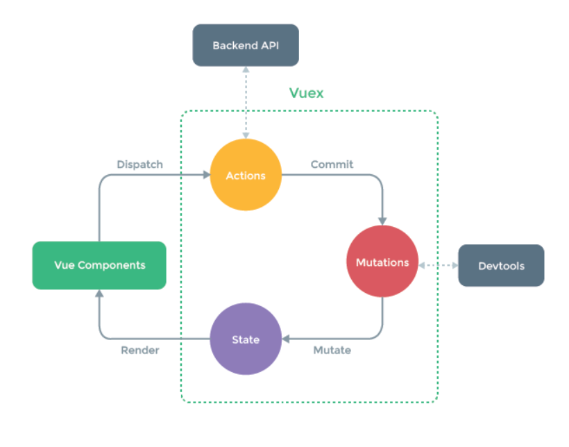

# 状态管理

## 使用 `vuex` 进行状态管理

- Vue2.0 使用的是 `vuex` 的 `3.x` 版本
- 状态管理指的是集中对 Vue 中 `data` 选项中的数据进行管理
- 优点:
  - 集中管理
  - 支持响应式操作
  - 单独的状态管理模块
- 在大型项目中, 使用 `vuex` 管理状态是理所应当的
- 在小型项目中, 可以不适用

## `vuex` 的操作机制



- 模块介绍
  - `State` 模块是一个用来存储状态的对象
  - `Vue Components` 是各个使用 `State` 状态的组件
  - `Actions` 是一个用来存储操作函数的对象
  - `Mutations` 是一个用来存储修改 `State` 函数方法的对象
- 机制
  - `State` 中的状态数据会被 `Render` 渲染到各个使用该数据的组件中
  - 在各个组件中, 如果需要操作该数据, 应当使用 `Dispatch` 方法调用一个存储在 `Actions` 对象中的方法
  - `Actions` 对象中的方法通过 `Commit` 一个在 `Mutation` 对象中存在的方法, 通知要修改的状态
  - `Mutations` 通过 `Mutate` 该方法, 实现对状态的修改

## 安装与使用

### 不使用项目构建工具 `vue/cli`

#### 概述

- 与引入路由的操作一致
- 使用 `npm i vuex@3 -S` 下载与 Vue2 对应的版本
- 在项目根目录下新建一个文件夹, 用来存放对 `vuex` 的配置
  - 引入 `vuex`, `import Vuex from 'vuex'`
  - 引入 `vue`, `import Vue from 'vue'`
  - 在 `vue` 中挂载 `vuex`, `Vue.use(Vuex)`
  - 创建数据仓库, `const store=new Vuex.Store({setting})`
    - `setting` 是对 `vuex` 的相关配置
    - 可配置的参数有 `store:{key:value}`, `actions:{fun(context,value){}}`, `mutations:{fun(state,value){}}`
      - `store:{key:value}` 中存放状态数据, 数据类型是 `key:value` 形式
      - `actions:{fun(context,value){}}` 中用来设置多个在组件中触发的函数, 参数 `context` 表示上下文. `context` 中包含一些额外的信息, 里面可以调用对应的 `commit` 方法, 参数 `value` 表示调用函数时传递的参数
      - `mutations:{fun(state,value){}}` 中用来设置多个利用 `commit` 触发的函数, 这些函数可以直接修改状态数据, 参数 `state` 中存放的就是状态数据, 参数 `value` 表示调用函数时传递的参数
      - 通常地, 将 `mutation` 中的函数名称写作大写形式
  - 导出仓库, `export default store`
- 在 `main.js` 文件中为创建的 `Vue` 实例进行配置
  - 导入数据仓库, `import store from path`
  - 在实例对象中, 配置 `store:store`
- 在组件中, 可以通过 `this.$store` 访问到对应的数据仓库
  - 通常地, 在组件中调用 `this.$store.dispatch(funName,value)` 方法触发一个 `action` 方法
  - 在数据仓库中, 对应的 `action` 方法会 `commit` 一个 `mutation` 中的方法
    - 即 `actions:{funName(context,value){context.commit(mutateName,value){}}}`
    - `mutateName` 是一个存放在 `mutations:{mutateName(state,value){}}` 中的方法, 该方法将会直接修改数据
- 如果需要处理的逻辑并不复杂, 在组件中可以直接调用 `this.$store.commit(mutateName,value)` 方法, 触发 `mutation` 中的方法直接修改数据

#### `state` 状态

- 唯一存放数据源的地方

```JavaScript
const store=new vuex.Store({
  state:{
    // 定义数据状态
    key:value
  }
})
```

- 在组件模板中, 使用 `{{$store.state.key}}` 的方式访问数据仓库中的数据
- 在组件 `methods` 中, 通过 `this.$store.state.key` 访问数据仓库中的数据

#### `actions` 对象

- 处理复杂逻辑的地方, 存放多个函数, **只有在这里支持处理异步请求**

```JavaScript
const store=new vuex.Store({
  actions:{
    // 定义多个需要在组件中被 dispatch 的函数方法
    funName(context,value){
      // 处理复杂逻辑
      // 参数 context 中存放有一些方法与数据
      // 参数 value 是在组件中传递的实参

      // 通过 context 调用 mutations 中的方法
      context.commit('mutateName',value)
    }
  }
})
```

- 在组件 `methods` 中, 通过 `this.$store.dispatch(funName,value)` 触发存放在 `actions` 中的同名方法 `funName`, `value` 指的是向方法传递的参数

#### `mutations` 对象

- 处理单一逻辑的地方, 存放多个函数

```JavaScript
const store=new vuex.Store({
  mutations:{
    // 定义多个可以在 actions 中被 commit 的函数方法
    mutateName(state,value){
      // 参数 state 是存放在数据仓库中的数据
      // 参数 value 是组件或者 actions 中的方法传递的实参

      // 直接修改 state 中的数据
      state.key=value
    }
  }
})
```

- 在数据仓库中, `actions` 中的函数 `funName` 通过调用 `context.commit(mutateName,value)` 触发存放在 `mutations` 中的同名方法 `mutateName`, `value` 指的是向方法传递的参数
- 特别地, 在组件中实现的逻辑较少的情况下, 可以直接在组件 `methods` 的方法中, 直接使用 `this.$store.commit(mutateName,value)` 触发 `mutations` 中的同名方法

#### `getters` 对象

- 相当于一个计算属性, 不会直接修改 `state` 中的数据
- 在 `getters` 中, 可以存放多个有返回值的方法

```JavaScript
const store=new vuex.Store({
  getters:{
    // 对当前 state 中的数据进行加工处理
    handlerState(state){
      // 参数 state 是存放在 state 中的所有数据
      return
    }
  }
})
```

- 在组件中模板中, 通过 `$store.getters.handlerState` 触发存放在 `getters` 中的同名方法, 直接显示被包装后的数据

### 辅助方法 `mapState()`

- 使用之前在当前组件中引入, `import {mapState} from 'vuex`
- `mapState` 方式用于将 `state` 中的数据**映射成为组件中的计算属性**
- `mapState` 的**返回值也是一个对象**, 需要使用展开运算符展开合并到当前 `computed` 中
- 它不需要单独使用 `$store.state.key` 的形式取出数据

#### 对象方式使用

- `mapState({funName1:'value1',funName2:'value2'})` 接收一个对象形式的参数
  - 参数中, `funName1` 与 `funName2` 指的是在计算属性中的方法名, 在模板中直接使用插值语法 `{{funName}}`, `value1` 与 `value2` 是对应的所需要的 `state` 中的数据, 一般采用字符串形式获取

```JavaScript
// 在组件的计算属性中
export default{
  computed:{
    // 不使用 mapState 方式获取 store 中的数据
    getKey(){
      return this.$store.state.key
    },
    // 使用 mapState 获取 state 中的数据
    // 将返回的方法对象展开合并到 computed 中
    // 这个方法与上述方法得到同样的结果
    ...mapState({getKey:'key'})
  }
}
```

#### 数组方式使用

- `mapState(['value1','value2'])` 接收一个数组形式的参数
  - 参数中, `value1` 与 `value2` 指的是对应的所需要的 `state` 中的数据, 使用字符串形式获取
- 在模板中直接使用插值语法 `{{value}}` 来展示数据
- 使用数组形式的参数形式, 表示在当前组件中, 状态名称与 `state` 中存放的状态名称一致

```JavaScript
// 在组件的计算属性中
export default{
  computed:{
    // 不使用 mapState 方式获取 store 中的数据
    key(){
      return this.$store.state.key
    },
    // 使用 mapState 获取 state 中的数据
    // 将返回的方法对象展开合并到 computed 中
    // 这个方法与上述方法得到同样的结果
    ...mapState(['key'])
  }
}
```

#### 函数方式使用

- `mapState({funName1(state){return}})` 接收一个对象形式的参数, 在对象中定义多个函数方法
  - `funName` 表示当前组件中计算属性的名, 模板中使用 `{{funName}}`
  - `state` 是方法接收的参数, 指的是 `state` 数据状态中的值
- 在函数写法中, 可以访问当前的组件实例 `this`

```JavaScript
// 在组件的计算属性中
export default{
  computed:{
    // 不使用 mapState 方式获取 store 中的数据
    getKey(){
      return this.$store.state.key
    },
    // 使用 mapState 获取 state 中的数据
    // 将返回的方法对象展开合并到 computed 中
    // 这个方法与上述方法得到同样的结果
    ...mapState({
      getKey(state){
        return state.key
      }
    })
  }
}
```

### 辅助方法 `mapGetters()`

- 使用之前在当前组件中引入, `import {mapGetters} from 'vuex`
- `mapGetters` 方式用于将 `getters` 中的数据**映射成为组件中的计算属性**
- 返回值也是一个对象, 需要使用展开运算符展开合并到 `computed` 中

#### 使用方式

- **有对象方式与数组方式**两种使用形式
- 与上述的 `mapState` 使用方法一致

### 辅助方法 `mapMutations()`

- 使用之前在当前组件中引入, `import {mapMutations} from 'vuex`
- `mapMutations` 方式用于将 `mutations` 中的函数方法**映射成为组件中的方法**
- 返回值也是一个对象, 需要使用展开运算符合并到 `methods` 中

#### 以对象形式使用

- 通过 `mapMutations({funName:'mutateName'})` 来调用数据仓库中的 `mutations` 中的同名 `mutateName` 方法
  - `funName` 指的是需要在当前组件中使用的方法名称
  - `mutateName` 指的是在数据仓库中的方法名
- 需要注意, 如果数据仓库中的 `mutateName` 方法需要接收参数, 那么在模板中**使用时要传递参数**

```JavaScript
// 在组件的 methods 方法中
export default{
  methods:{
    // 利用展开运算符将获取的 mutations 方法展开
    ...mapMutations({
      // funName 是在当前组件中使用的函数名称
      // mutateName 是在数据仓库中对应的函数名称
      funName1:'mutateName1',
      funName2:'mutateName2'
    })
  }
}
```

#### 以数组形式使用

- 通过 `mapMutations(['mutateName'])` 来调用数据仓库中的 `mutations` 中的同名 `mutateName` 方法
  - 使用数组形式的方法不需要在当前组件中为 `mutations` 中的方法更名, 直接使用数据仓库中的原方法 `mutateName` 即可
- 需要注意, 如果数据仓库中的 `mutateName` 方法需要接收参数, 那么在模板中**使用时要传递参数**

```JavaScript
// 在组件的 methods 方法中
export default{
  methods:{
    // 利用展开运算符将获取的 mutations 方法展开
    ...mapMutations(['mutateName1','mutateName2']) // mutateName 是数据仓库中 mutations 中的同名方法, 在当前组件中直接使用该名称即可
  }
}
```

### 辅助方法 `mapActions()`

- 使用之前在当前组件中引入, `import {mapActions} from 'vuex`
- `mapActions` 方式用于将 `mapActions` 中的函数方法**映射成为组件中的方法**
- 返回值也是一个对象, 需要使用展开运算符合并到 `methods` 中

#### 使用方法

- 使用方法与上述的 `mapMutations` 一致

### `Modules` 模块管理

- 数据集中在 `store` 中会显得非常臃肿
- 划分为模块后, 每个模块都有自己单独的 `state`, `actions`, `mutations` 与 `getters`
- `modules` 可以嵌套

#### `modules` 对象

- 在 `vuex` 中与其余选项一样, 在创建 `store` 实例时进行配置

```JavaScript
const store=new vuex.Store({
  modules:{
    // 定义的子模块
    customedModule1:{
      namespaced:false, // 默认为 false
      state:{},
      actions:{},
      mutations:{},
      getters:{},
      modules:{
        // modules 可以进行嵌套
      }
    },
    customedModule2:{
      namespaced:false, // 默认为 false
      state:{},
      actions:{},
      mutations:{},
      getters:{}
    }
  }
})
```

- 默认情况下, 在进行上述的模块化后, `state` 中的状态实现了模块化管理, 但是对于 `actions`, `mutations` 以及 `getters` 中的函数方法, 仍然是统一被挂载到根模块中
  - 要解决这个问题, 需要在定义模块时, 添加属性 `namespaced:true` 开启命名空间, 开启命名空间后, 函数方法将也会被划分到各自的模块中
  - **函数的名称也会对应更改为 `moduleName/customedName` 显示**

#### 在组件中访问模块化中的数据

**一般方式.**

- 访问模块中的 `state`
  - 在模板中直接使用 `$store.state.customedModule1.key` 访问 `customedModule1` 模块中的 `state` 中的数据
- 访问模块中的 `actions`
  - 在组件的 `methods` 选项中, 通过 `this.$store.dispatch('moduleName/funName')` 来触发在对应模块中的同名方法
  - `moduleName` 指的是模块名称
  - `funName` 指的是定义在模块中 `actions` 中的同名方法
- 访问模块中的 `mutations`
  - 在组件的 `methods` 选项中, 通过 `this.$store.commit('moduleName/funName')` 来触发在对应模块中的同名方法
  - `moduleName` 指的是模块名称
  - `funName` 指的是定义在模块中 `mutstions` 中的同名方法
- 访问模块中的 `getters`
  - 在模板中, 通过 `$store.getters['moduleName/funName']` 获取定义在 `getters` 中的方法
  - 因为开启命名空间之后, 除开定义在 `state` 中的数据被包裹在以模块名定义的对象之中, `getters`, `actions` 与 `mutations` 中的方法名称都被更改为 `moduleName/funName` 的形式, 所以访问时, 使用 `[]` 访问

**辅助函数方式.**

- 访问模块中的 `state`
  - 在组件的 `computed` 选项中, 使用 `mapState('moduleName',method)` 方法获取模块中的数据
  - `moduleName` 指的是模块的名称
  - `method` 指的是用来获取当前模块中的 `state` 的方式, 可以使用**对象形式, 数组形式或者函数形式**
- 访问模块中的 `actions`
  - 在组件的 `methods` 选项中, 使用 `mapActions('moduleName',method)` 方法使用模块中定义的 `actions` 中的方法
  - `moduleName` 指的是模块的名称
  - `method` 指的是可以使用**对象或者数组的形式**访问定义在模块 `actions` 中的同名方法
- 访问模块中的 `mutations`
  - 在组件的 `methods` 选项中, 使用 `mapMutations('noduleName',method)` 方法使用模块中定义的 `mutations` 中的方法
  - `moduleName` 指的是模块的名称
  - `method` 指的是可以使用**对象或者数组的形式**访问定义在模块 `mutations` 中的同名方法
- 访问模块中的 `getters`
  - 在组件的 `computed` 选项中, 使用 `mapGetters('moduleName',method)` 方法使用模块中定义的 `getters` 中的方法
  - `moduleName` 指的是模块的名称
  - `method` 指的是可以使用**对象或者数组的形式**访问定义在模块 `getters` 中的同名方法

#### 带命名空间下的模块访问根状态(模块数据互通)

**在模块的 `getters` 中访问全局 `state` 与 `getters`**

- 在 `vuex` 的 `getters:{fun(state,getters,rootState,rootGetters)}` 方法中, 可以接收多个参数
  - `fun` 是定义在 `getters` 选项中的方法
  - `state` 是当前模块中的数据状态
  - `getters` 是当前模块中的 `getters` 选项
  - `rootSate` 是当前组件的根状态
  - `rootGetters` 是当前组件的根 `getters` 选项

**在模块的 `actions` 中访问全局 `state` 与 `getters`**

- 在 `vuex` 的 `actions:{fun(context,value)}` 方法中, `context` 参数规定了一些用来访问根数据的属性
  - `context` 中有 `rootState` 与 `rootGetters` 属性, 可以用来访问根状态

**在模块的 `actions` 中访问全局 `actions` 与 `mutations`**

- 在 `vuex` 的 `actions:{fun(context,value)}` 方法中, 利用 `context` 中的 `dispatch` 与 `commit` 方法, 可以触发在根上的对应方法
  - 使用时, 需要接收第三个参数 `{root:true}`, 即 `fun(context,value,{root:true})` 来实现触发

### 目录结构

- 在 `store` 文件夹中
  - `index.js` 一般用来配置数据仓库, 导入各个选项文件
  - 各个选项分别建立对应的 `.js` 文件并导出
    - `state.js` 用来存放数据状态
    - `actions.js` 用来存放 `actions` 选项
    - `mutations.js` 用来存放 `mutations` 选项
    - `getters.js` 用来存放 `getters` 选项
  - `mudules` 文件夹用来存放模块
    - `index.js` 用来合并所有的模块
    - 建立多个 `moduleName.js` 文件用来配置模块信息

### `vuex` 的严格模式

- 在严格模式中, 只要不是通过触发 `mutations` 中的方法来改变了 `state` 中的数据状态, 就会报错
- 开启严格模式, 在新建 `store` 实例时, 添加 `strict:true` 表示开启了严格模式
- 通常地, 严格模式只适用于在开发环境中开启
  - 使用构建工具实现自动判断是否开启严格模式
  - `strict:process.env.NODE_ENV !== 'production'`

### 表单处理

- 在开启严格模式后, 在表单元素中使用 `v-model` 双向绑定时, 表单中的输入数据会企图直接修改 `state` 中的数据, 这样会抛出错误

#### 使用 `v-model` 原理解决

- 在表单元素中 `<input type="text" :value="bindData" @input="handlerInput" />` 利用 `value` 属性动态绑定数据, 实现 `Model => View` 层的绑定. 再监听 `input` 事件, 当输入框中的内容发生改变后, 触发事件, 提交 `mutations` 中的对应方法实现对 `state` 的修改, 实现 `View => Model` 层的绑定

```JavaScript
import {mapState} from 'vuex'
export default{
  computed:{
    // 将仓库中的 storeState 数据绑定到当前 input 中
    ...mapState({bindData:'storeState'})
  },
  methods:{
    handlerInput(e){
      // 触发仓库中的 mutations 中名为 STORE_MUTATIONS_FUN 的同名方法
      this.$store.commit('STORE_MUTATIONS_FUN',e.target.value)
    }
  }
}
```

- 这种方法比较繁琐， 失去了 `v-model` 本身的便捷

#### 使用计算属性的完整写法

- 定义一个计算属性时, 如果只是单纯访问计算属性的值, 一般地, 我们使用计算属性的简写方式 `computed:{computedProp(){return xxx}}`
- 计算属性的完整写法应当是一个包含了 `set` 与 `get` 方法的对象
  - `computed:{computedProp:{get(){return xxx},set(value){}}}`
- 为了实现 `v-model` 的双向数据绑定, 并且为了实现简单, 可以在计算属性中利用 `set` 与 `get` 方法对仓库中的数据进行处理

```JavaScript
export default{
  computed:{
    computedProp:{
      get(){
        // 获取数据仓库中的数据, 在当前组件中展示
        return this.$store.storeState
      },
      set(value){
        // 触发数据仓库中的 mutations 中的同名方法 STORE_MUTATIONS_FUN
        this.$store.commit('STORE_MUTATIONS_FUN',value)
      }
    }
  }
}
```
